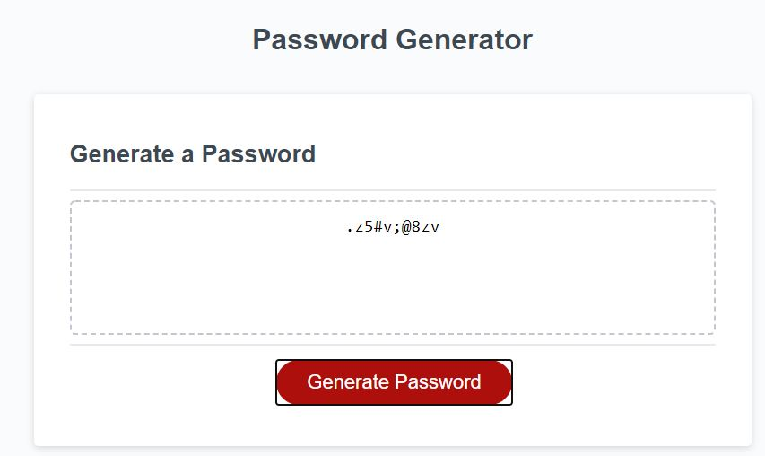

# Random Password Generator

This website allows a user to generate a random password based on user selection criteria:
* password length
* which characters to include:
    * upper characters
    * lower characters
    * numbers
    * special characters

After prompting a user for selection criteria, a random password of requested length is generated. This password contains at least one character from each selected 
type of characters and includes only characters of the selected types.

# Deployed web site

The link to deployed site is https://evkonradi.github.io/RandomPassword/.

# GitHub repository

You can find the repository here: https://github.com/evkonradi/RandomPassword.

# Page preview

This is the preview of the web site:
